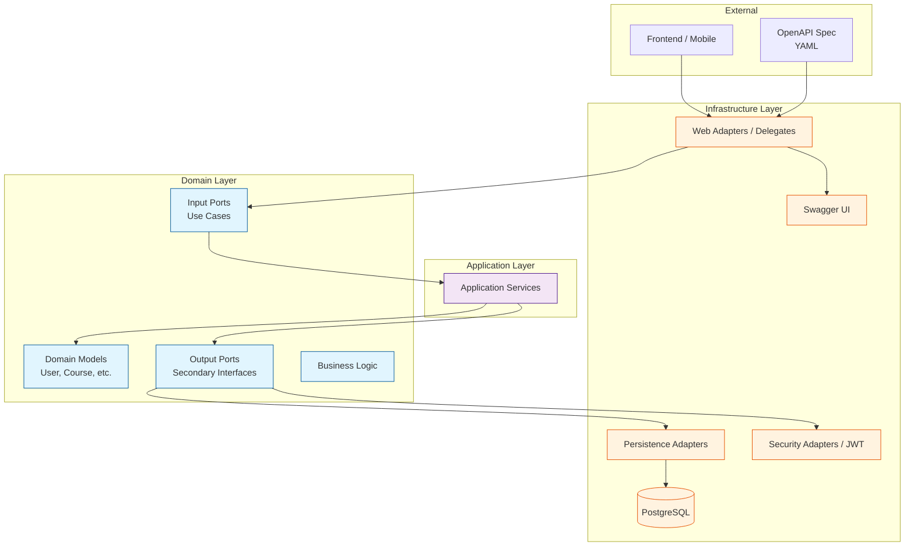
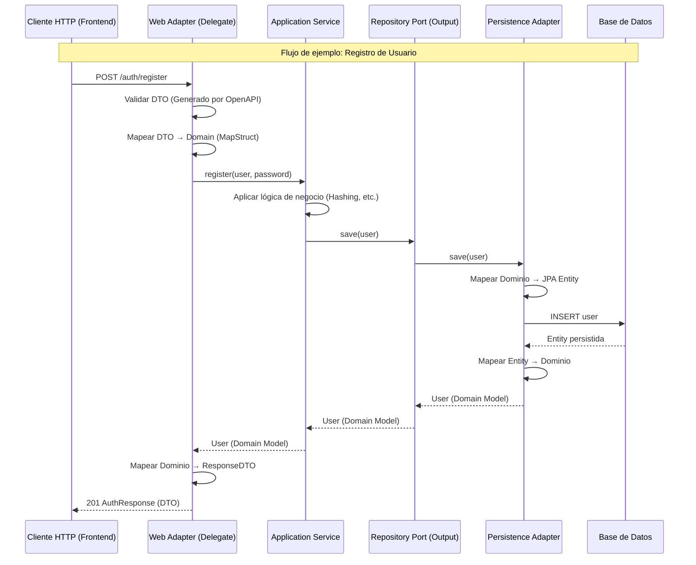
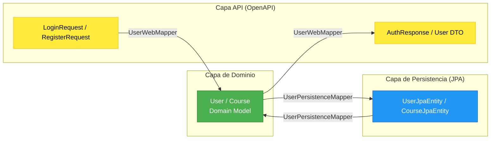

# 🌱 GrowUp Backend API

## API-First + Hexagonal Architecture with Spring Boot

Este proyecto implementa el backend de la plataforma **GrowUp** utilizando una **Arquitectura Hexagonal (Puertos y Adaptadores)** combinada con un enfoque **API-First** mediante OpenAPI, Spring Boot y MapStruct.

## 🏗️ Arquitectura Hexagonal

### Diagrama de Arquitectura General



### Flujo de Datos API-First



## 📁 Estructura del Proyecto

```
src/main/java/com/growup/backend/
├── 🟦 domain/                          # Capa de Dominio (Núcleo)
│   ├── model/                          # Modelos de negocio puros (POJOs)
│   │   ├── User.java
│   │   ├── Course.java
│   │   ├── Enrollment.java
│   │   └── ...
│   └── port/                           # Puertos del Dominio (Contratos)
│       ├── in/                         # Puertos de Entrada (Casos de Uso)
│       │   ├── AuthInPort.java
│       │   ├── CourseInPort.java
│       │   └── ...
│       └── out/                        # Puertos de Salida (Interfaces de Infraestructura)
│           ├── UserPersistencePort.java
│           ├── TokenGeneratorPort.java
│           └── ...
│
├── 🟪 application/                     # Capa de Aplicación
│   └── service/                       # Servicios de aplicación
│       ├── AuthService.java
│       ├── CourseService.java
│       └── ...
│
└── 🟨 infrastructure/                  # Capa de Infraestructura
    ├── adapter/
    │   ├── web/                       # Adaptadores de Entrada (REST)
    │   │   ├── mapper/                # Mappers DTO ↔ Dominio
    │   │   ├── AutenticacinWebAdapter.java
    │   │   ├── CursosWebAdapter.java
    │   │   └── ...
    │   ├── persistence/               # Adaptadores de Salida (Persistencia)
    │   │   ├── jpa/                   # Repositorios y Entidades JPA
    │   │   ├── CoursePersistenceAdapter.java
    │   │   └── ...
    │   └── security/                  # Adaptadores de Seguridad
    │       └── JwtTokenGeneratorAdapter.java
    ├── mapper/                        # Mappers Dominio ↔ JPA Entity
    ├── exception/                     # Gestión de excepciones global
    └── config/                        # Configuración de infraestructura
```

## 🔄 Mapeo entre Capas

### Diagrama de Transformación



## 🛠️ Tecnologías Utilizadas

| Capa              | Tecnología                   | Propósito                                  |
| ----------------- | ---------------------------- | ------------------------------------------ |
| **API-First**     | OpenAPI 3.0 + Maven Plugin   | Generación de código a partir del contrato |
| **REST**          | Spring Boot Web              | Controladores y endpoints REST             |
| **Seguridad**     | Spring Security + JWT        | Autenticación y Autorización               |
| **Mapeo**         | MapStruct                    | Transformaciones automáticas entre capas   |
| **Persistencia**  | Spring Data JPA + PostgreSQL | Capa de datos                              |
| **Documentación** | SpringDoc OpenAPI            | Interfaz Swagger UI automática             |
| **Utilidades**    | Lombok                       | Reducción de código boilerplat             |

## 🚀 Configuración API-First

### 1. Especificación OpenAPI
El contrato de la API se define en `src/main/resources/api-docs.yaml`.

### 2. Generación Automática
Al compilar con Maven, el plugin genera las interfaces de los controladores y los DTOs en la carpeta `target/generated-sources/openapi`.

### 3. Implementación del Adaptador
Nuestros adaptadores web implementan los "Delegates" generados:
```java
@Component
@RequiredArgsConstructor
public class AutenticacinWebAdapter implements AutenticacinApiDelegate {
    private final AuthInPort authInPort;
    private final UserWebMapper userMapper;

    @Override
    public ResponseEntity<AuthResponse> authRegisterPost(RegisterRequest registerRequest) {
        User user = userMapper.toDomain(registerRequest);
        User registered = authInPort.register(user, registerRequest.getPassword());
        // ...
    }
}
```

## 🎯 Principios de Arquitectura Aplicados

1.  **Inversión de Dependencias**: El dominio no depende de la infraestructura; los adaptadores dependen de los puertos (interfaces en el dominio).
2.  **Puertos y Adaptadores**: Interfaces claras que permiten cambiar la tecnología de persistencia o comunicación sin tocar la lógica de negocio.
3.  **Testabilidad**: La lógica de negocio está aislada y puede probarse con tests unitarios sin levantar una base de datos.
4.  **Contrato Primero (API-First)**: El contrato es la fuente de verdad única para el frontend y el backend.

## 📚 Recursos Adicionales

- **Swagger UI**: [http://localhost:8080/swagger-ui.html](http://localhost:8080/swagger-ui.html)
- **API Docs**: [http://localhost:8080/v3/api-docs](http://localhost:8080/v3/api-docs)

---
🌱 **GrowUp** - *Cultivando el conocimiento a través de una arquitectura limpia.*
